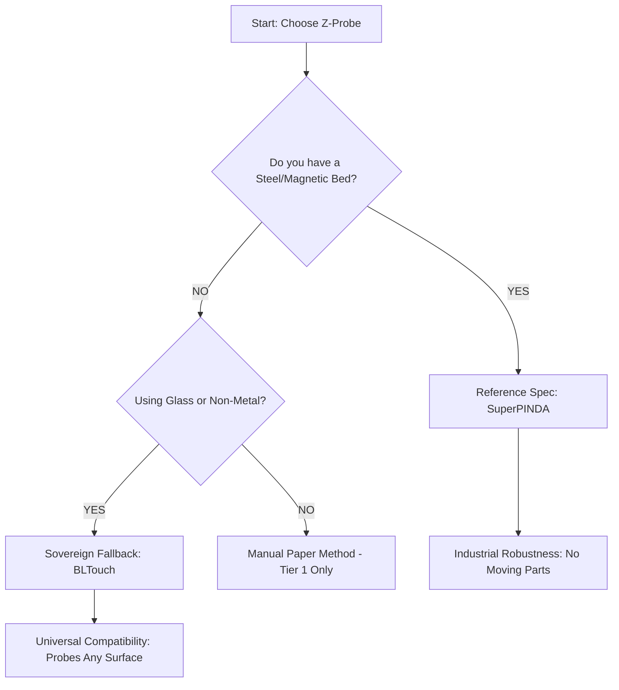

# ADR-006: Z-Probe Selection (SuperPINDA vs BLTouch)

## Status
**Archived** - Superseded by ADR-014: Z-Probe Selection

> This ADR has been replaced by ADR-014, which provides more comprehensive coverage including BOM implications and implementation details. See `014-z-probe-selection.md`.

## Context

The Z-probe is the "eyes" of the Tractor’s Triple-Z system. While Klipper's software intelligence handles the math, the probe provides the physical ground truth required for kinematic leveling and first-layer perfection.

## Decision

We adopt a **Bimodal Reference Strategy**:

1. **Reference Spec (The Tractor Standard):** **SuperPINDA** (Inductive). Chosen for its solid-state reliability and "set-and-forget" robustness.
2. **Sovereign Fallback (The Scavenger Standard):** **BLTouch v3.1** (Physical). Chosen for its ability to probe any surface, including salvaged glass or non-metallic beds.

---

### 🦾 The Case for SuperPINDA (Reference Spec)

* **Solid-State Reliability**: With zero moving parts, it cannot snag on a print or fail to "deploy." It is nearly indestructible.
* **Thermal Stability**: Unlike the older PINDA v2, the **SuperPINDA** is temperature-compensated, ensuring the same trigger height at room temperature or 100°C.
* **Simplicity**: Uses only 3 wires (VCC, GND, Signal) compared to the 5 wires required for a BLTouch.
* **Constraint**: Requires a **conductive metal bed** (e.g., Spring Steel, Aluminum).

### 🛠️ The Case for BLTouch (Sovereign Fallback)

* **Universal Compatibility**: The "Swiss Army Knife" of probes. It works on glass, ceramic, wood, or aluminum.
* **Scavenger Hero**: Essential for Tier 1 builders using salvaged Ender 3 or i3 Mega glass beds.
* **Trade-off**: Higher mechanical complexity. The moving pin can bend or break if it strikes a print or bed clip.

---

## 📊 Revised Decision Tree



---

## 🏗️ Implementation Tweaks

### 1. Wizard Configuration (`configure.py`)

The build script should now ask the user: *"What is your bed surface?"*

* **Glass/Ceramic/Other:** Forces the BLTouch configuration in `printer.cfg`.
* **Steel/Aluminum:** Recommends the SuperPINDA but allows the BLTouch as an alternative.

### 2. Klipper Configuration Permutations

```python
# The script will now output distinct blocks based on the choice:

# [PATH A: INDUCTIVE PROBE]
[probe]
pin: ^board:probe_pin
z_offset: 0.0  # Adjust for SuperPINDA

# [PATH B: BLTOUCH]
[bltouch]
sensor_pin: ^board:sensor_pin
control_pin: board:control_pin
z_offset: 1.5  # Adjust for BLTouch

```

### 3. Z-Max "Bed-Drop" Brake

Regardless of the probe chosen, the **Z-Max physical microswitch** at the bottom of the frame remains **mandatory**. The probe handles the surgery at the nozzle; the switch handles the safety at the floor.

---

## Consequences

* **Benefits**: Builders aren't forced to buy a new steel sheet if they have glass beds, but are encouraged toward the PINDA for long-term reliability.
* **Documentation Effort**: The assembly guide must now provide wiring diagrams for both 3-wire (PINDA) and 5-wire (BLTouch) sensors across all supported MCUs (SKIPR, Spider, etc.).

> **"A PINDA is a sensor for the machine; a BLTouch is a tool for the material. We provide the iron for the path you choose."**